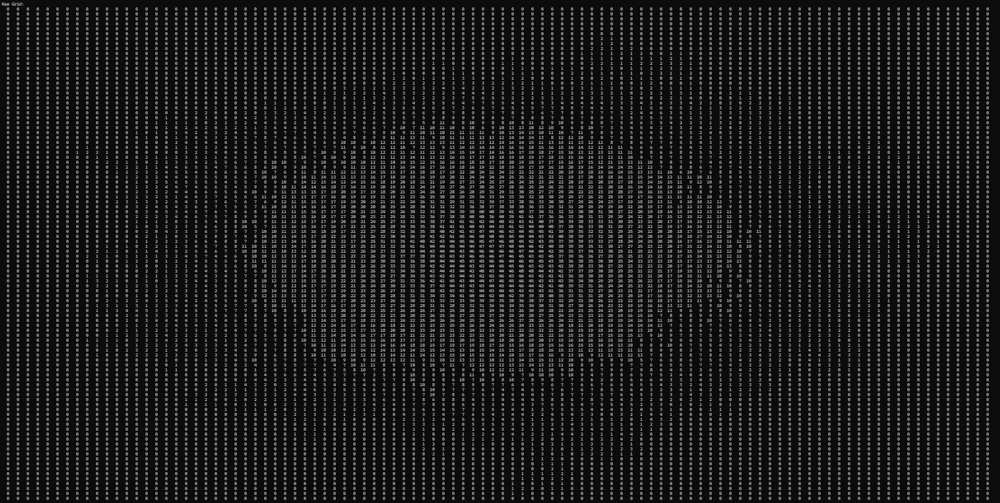
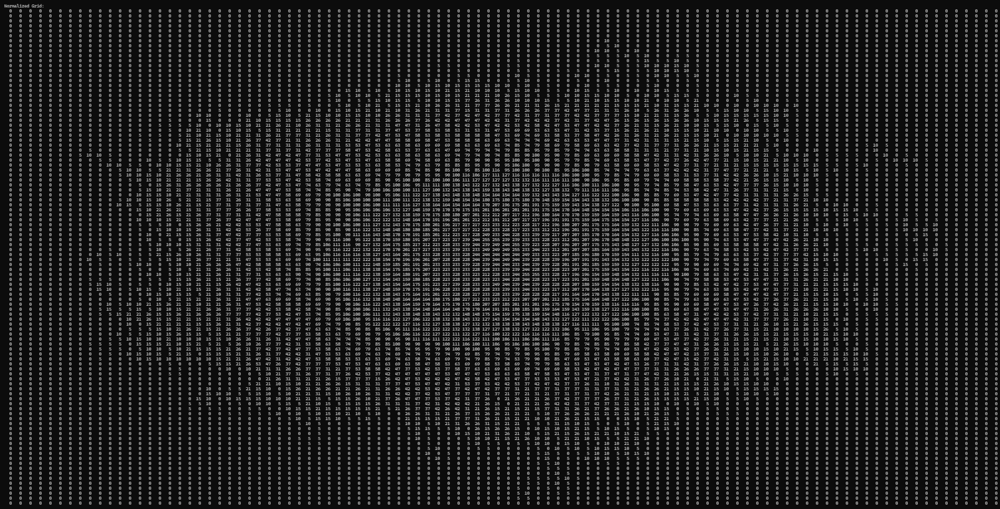
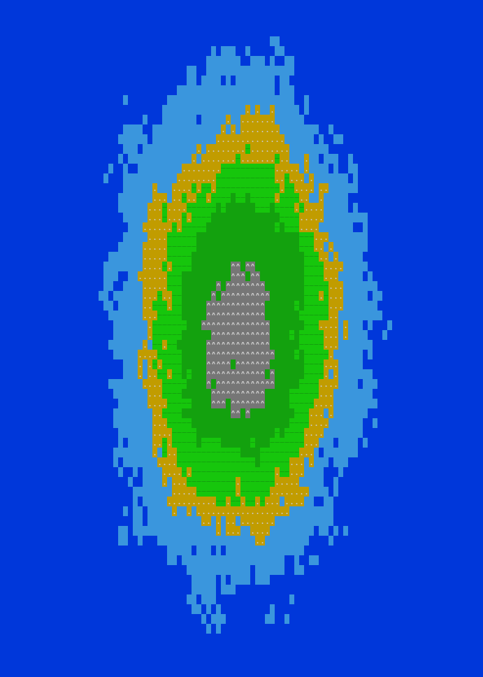

# Island Generator
This program is designed to generate a 2D island map based on user inputs for dimensions, drop zones, particles, and other parameters. The generated island is visualized using different terrain types and colors.

## Description
The program generates a raw particle map which is then normalized and transformed into a polished island with various terrain types. It utilizes the `termcolor` library by Ihor Kalnytskyi to color the output in the terminal.

## Features
- **Particle-based Island Generation**: Drops particles on a grid and simulates their movement based on defined parameters.
- **Normalization**: Scales particle values to fit within a range **(0-255)** for better visualization.
- **Island Generation**: Converts the normalized data into a map with distinct terrain types.
- **Colorized Output**: Uses ANSI escape codes to colorize the terminal output for better readability.

## Usage
To run the program, compile and execute the code. You can optionally provide a seed for the random number generation. <br> 
**Compilation**
```bash
g++ -o island_generator island_generator.cpp
```
```bash
<exe> [-s seed]
```

```bash
./island_generator
```

```bash
./island_generator -s 123
```

## Example
**Raw Grid**


**Normalized Grid**


**Polished Island** <br>


## Credits
This project uses the [termcolor]([https://github.com/termcolor/termcolor](https://github.com/ikalnytskyi/termcolor?tab=License-1-ov-file) library by Ihor Kalnytskyi, which is licensed under the following conditions:
Copyright (c) 2013, Ihor Kalnytskyi. All rights reserved.

Redistribution and use in source and binary forms of the software as well
as documentation, with or without modification, are permitted provided
that the following conditions are met:

Redistributions of source code must retain the above copyright
notice, this list of conditions and the following disclaimer.

Redistributions in binary form must reproduce the above
copyright notice, this list of conditions and the following
disclaimer in the documentation and/or other materials provided
with the distribution.

The names of the contributors may not be used to endorse or
promote products derived from this software without specific
prior written permission.

THIS SOFTWARE AND DOCUMENTATION IS PROVIDED BY THE COPYRIGHT HOLDERS AND
CONTRIBUTORS "AS IS" AND ANY EXPRESS OR IMPLIED WARRANTIES, INCLUDING, BUT
NOT LIMITED TO, THE IMPLIED WARRANTIES OF MERCHANTABILITY AND FITNESS FOR
A PARTICULAR PURPOSE ARE DISCLAIMED. IN NO EVENT SHALL THE COPYRIGHT OWNER
OR CONTRIBUTORS BE LIABLE FOR ANY DIRECT, INDIRECT, INCIDENTAL, SPECIAL,
EXEMPLARY, OR CONSEQUENTIAL DAMAGES (INCLUDING, BUT NOT LIMITED TO,
PROCUREMENT OF SUBSTITUTE GOODS OR SERVICES; LOSS OF USE, DATA, OR
PROFITS; OR BUSINESS INTERRUPTION) HOWEVER CAUSED AND ON ANY THEORY OF
LIABILITY, WHETHER IN CONTRACT, STRICT LIABILITY, OR TORT (INCLUDING
NEGLIGENCE OR OTHERWISE) ARISING IN ANY WAY OUT OF THE USE OF THIS
SOFTWARE AND DOCUMENTATION, EVEN IF ADVISED OF THE POSSIBILITY OF SUCH
DAMAGE.
